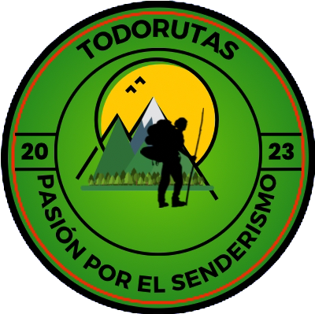

# TodoRutas

## Sobre Nosotros

En TodoRutas, somos un equipo apasionado de amantes del senderismo que busca inspirar a las personas a conectarse con la naturaleza y descubrir nuevas aventuras al aire libre.

Nuestra misión es ofrecer productos de alta calidad para el senderismo que te acompañarán en cada paso de tu camino. Además, compartimos nuestros conocimientos y experiencias a través de nuestro blog, brindando consejos prácticos y recomendaciones de expertos.

En TodoRutas, valoramos las conexiones reales y duraderas. Organizamos excursiones grupales y eventos especiales para que puedas unirte a nosotros en emocionantes aventuras en la naturaleza.

Únete a TodoRutas y descubre un mundo de senderismo, superación personal y recuerdos inolvidables. Te invitamos a ser parte de nuestra comunidad y a explorar nuevas rutas juntos.

¡Bienvenido a TodoRutas, donde cada paso es una nueva aventura! 

## A continuación, verás los productos que tenemos disponibles:

- Mochilas
- Bastones
- Zapatillas
- Ropa
- Kit de accesorios
- Termos
- Carpas
- GPS 

## Público Objetivo
 Tengo un ecommerce de articulos para senderismo y mi público ronda entre los 18 y 65 años. 

## Tipografía principal
Ubuntu Condensed

## Paleta de colores 
#3F0910 , #3D4E2A , #486E26 

## Logo 

